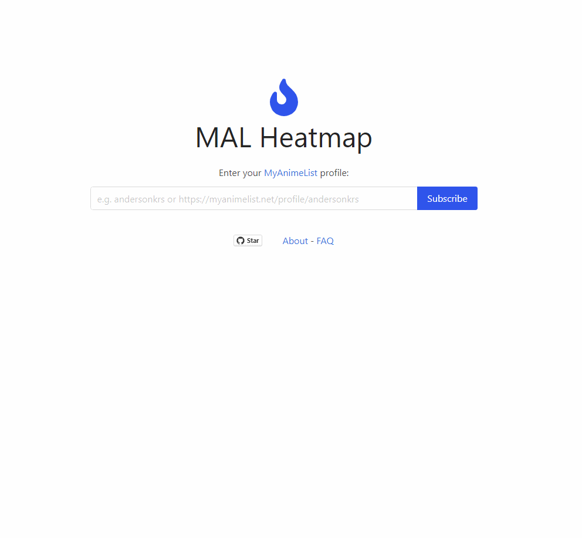

<h1 align="center">
  MAL Heatmap
</h1>

<h4 align="center">
  
</h4>

 <a href="https://malheatmap.com">https://malheatmap.com</a>

<table>
<tr>
<td>
  MAL Heatmap is a tool for tracking your anime/manga consumption based on your <a href='https://myanimelist.net'>myanimelist.net</a> recent history. 
  This app crawls the recent user history daily and generates a full visualization of all activities like <a href='https://github.blog/2013-01-07-introducing-contributions/'>Github contributions calendar</a>.
    
  It also generates an image of your activities calendar that you can embed into your <a href='https://myanimelist.net'>myanimelist.net</a> profile or forum signature extending your MAL experience. 
</td>
</tr>
</table>

#### Motivation

I've made this experiment to play around with some cool Rails features, like [ActiveStorage](https://edgeguides.rubyonrails.org/active_storage_overview.html) and [ActionCable](https://guides.rubyonrails.org/action_cable_overview.html). Also, I want to try web scrapping with Ruby and learn more about it.

Over the years I've made several upgrades, adding Turbo, SolidQueue, better caching with Russian Doll caching + HTTP Caching, etc.

#### How it works

The web app displays the processed data and a set of jobs do the hard and dirty work of crawling, processing, and saving data.

So, when the user subscribes

<table>
  <tr>
    <th>Demo</th>
  </tr>  
  <tr>
    <td>
      
    </td> 
  </tr>
</table>

### Future

The plan is to consume data solely from MAL's API and drop the web crawling. That will require some deep reorganization of the code and how the activities are calculated since MAL does not have an API for history usage and they don't seem to have that in their roadmap.

#### Main Tools

* Ruby on Rails
* SQLite
* Bulma CSS

#### Developing

Dependencies:

* SQLite
* Redis for action cable 
* Ruby
* [ImageMagick](https://imagemagick.org/index.php)

Since this app is a classical Rails project, there is nothing special here to either set up the project or run it.

### Deployment

This app is gloriously deployed with [Kamal](https://kamal-deploy.org/).

Since I keep this app running from my pocket, I use some space to run this app on my tiny VPS, to keep costs low, we use the VPS storage to host the ActiveStorage files.

#### Other Inspirations

* [MAL Signature](https://malsignature.com)
* [anime.plus](https://anime.plus)

